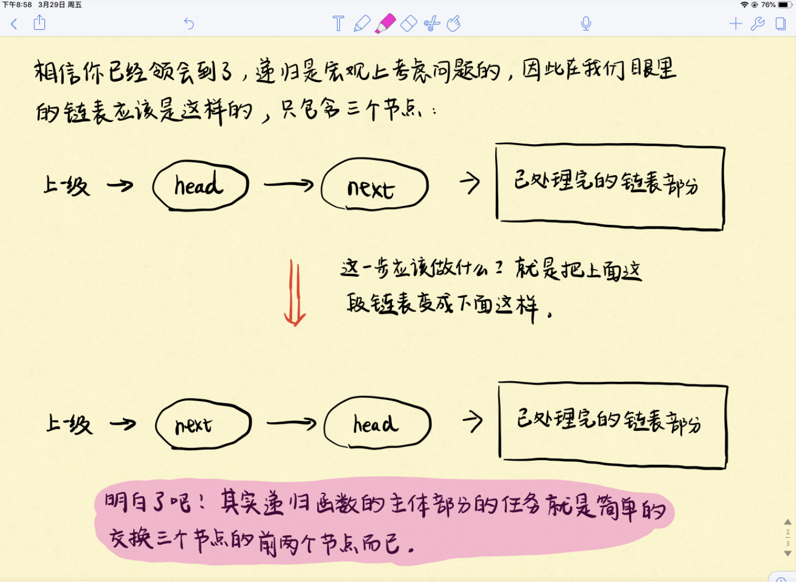

# 递归
值得一看
https://lyl0724.github.io/2020/01/25/1/
直接上三部曲模版：

## 找终止条件。
什么情况下递归终止？没得交换的时候，递归就终止了呗。
因此当链表只剩一个节点或者没有节点的时候，自然递归就终止了。
## 找返回值。 
我们希望向上一级递归返回什么信息？
由于我们的目的是两两交换链表中相邻的节点，因此自然希望交换给上一级递归的是已经完成交换处理，即已经处理好的链表。
## 本级递归应该做什么。 
结合第二步，看下图！由于只考虑本级递归，所以这个链表在我们眼里其实也就三个节点：head、head.next、已处理完的链表部分。而本级递归的任务也就是交换这3个节点中的前两个节点，就很easy了。
